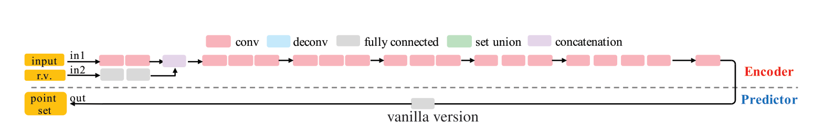

## Short Description

- Generate unordered point cloud from a single image.
- Earth Mover Distance, metric for the reconstruction of a point cloud.

## Notes

- **What is the objective of the paper  ?**
  
  - Get a 3d representation of an object given a single image

- **How is the 3d space represented ?**
  
  - Its a set point problem, with S = {(x,y,z)} with a fixed size N
  - More flexible than voxel or 2d representation

- **What is the objective of the network ?**
  
  - Given an image I, the ground truth is P(*|I)
  - The network is such that S = G(I,r; $\theta$), where r is sampled from a normal distribution and allows for different sampling of the same object

- **What is the base model for a Point Predictor Network ?**
  
    
  
  - The idea is to use a network with two stages: encoder and predictor
  - The encoder, takes the input image I and transforms it into a latent vector (embedded space)
  - Then, the predictor, takes this latent vector representation and outputs N points, each with x,y,z coordinates. This is done using a fully connected layer.

- **In what way is the network improved ?**
  
    
  
  - The network is improved by having the same encoder, but then using the same encoder but having two branches for the Predictor.
  - One branch is a fc layer, which allows for flexibility in the representation
  - The second one i outputs an image with 3 channels. This allows to include structure in the representation of the output, since the image is outputted together, whereas the fc layer each point is individually predicted.
  - The outputs are merged together with a set union (just use all the points)

- **What is the Champfer distance ?**
  
    
  
  - The first term forces the output to lie close to the gt. The second forces the output to cover the entirety of the gt.

- **What is the Earth Mover's Distance  ?**
  
  - The EDM is a distance metric between two sets S1 S2 of equal size (cardinality).
    
      
  
  - The distance defines an optimization algorithm (finding of $\phi$). In practice this is too expensive, so it is approximated.

- **What is the problem with neural networks generating shapes?**
  
  - Although neural network have high generalization capabilities, they tend to predict the mean of a shape.
  
  - The authors test the two metrics Champfer distance and EMD to see what kind of output they give:
    
      
  
  - It can be seen that EDM outputs the averadge, whereas CD returns blurry contours.

- **How can we generate distribution outputs, instead of a single one  ?**
  
    
  
    

- **What other types of architectures can be used to generate distributional outputs ?**
  
  - CGANS and VAE.
  - They have a dedicated network to process the input (3d points) in the target format.
  - This then allows to make predictions or generate latent representations.