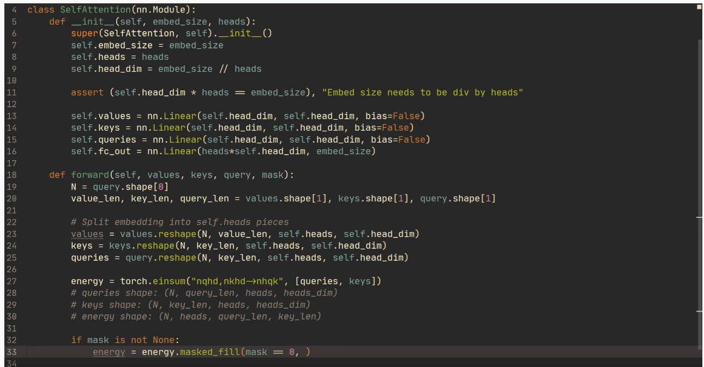

## Introduction

- What is the main **difference** between recurrent neural networks (**RNN**) and the **Transformer** network?
  - RNN process inputs in a sequential manner. Each input is processed by generating a hidden state $h_{t-1}$ which is fed at time $t$ into the state $h_t$
  - This constrains the network to be processed the input in a sequential manner
  - The attention mechanism is instead used to allow the network to process inputs independently of their sequential position
  - The transformer network relies only on the attention method and does not use any recurrent network
  - NB: the attention mechanisms is basically a fully connected network which outputs some probabilities which represent the weights of each word in a sentence.

## Background

- What is the **goal** of the **Transformer** architecture?
  - Other networks that process sequential inputs need to create hidden states for each of the inputs.
  - However, in past models, in order to create a relation between an input representation and output, the number of operations grows exponentially with the number of words. Hence making it more difficult to learn dependencies between distant points.


### Encoder Decode Architecture

- What is the idea behind the **encoder** **decoder** **architecture** when processing a sequential input?
  - The encoder, given a sequence of inputs (x1, ..., xn) generates a continuous  representation (z1, ..., zn)
  - The decoder then, given the input sequence (z1, ..., zn), returns an output sequence (y1, ..., ym) one element at the time. Each element is computed by having as input the last generated output (y) and the next input (z).


### Decoder

- Describe the **decoder**.
  
  - Notice: in the paper they say that
    
    - "encoder-decoder attention" layers, the queries come from the previous decoder layer, and the memory keys and values come from the output of the encoder.
  
  - This can be achieved when implementing the attention layer, the input is not just x but we actually define keys values and queries
    
    - [https://www.youtube.com/watch?v=U0s0f995w14&t=893s](https://www.youtube.com/watch?v=U0s0f995w14&t=893s)
      
      
  
  - Notice: a bit different when we do it like in the blog post:
    
    ```python
    import torch
    from torch import nn
    import torch.nn.functional as F
    
    class SelfAttention(nn.Module):
        def __init__(self, k, heads=8):
            super().__init__()
            self.k, self.heads = k, heads
            # These compute the queries, keys and values for all
            # heads (as a single concatenated vector)
            self.tokeys = nn.Linear(k, k * heads, bias=False)
            self.toqueries = nn.Linear(k, k * heads, bias=False)
            self.tovalues = nn.Linear(k, k * heads, bias=False)
    
            # This unifies the outputs of the different heads into
            # a single k-vector
            self.unifyheads = nn.Linear(heads * k, k)
    
    def forward(self, x):
        b, t, k = x.size()
        h = self.heads
    
        queries = self.toqueries(x).view(b, t, h, k)
        keys = self.tokeys(x).view(b, t, h, k)
        values = self.tovalues(x).view(b, t, h, k)
    
        # - fold heads into the batch dimension
        keys = keys.transpose(1, 2).contiguous().view(b * h, t, k)
        queries = queries.transpose(1, 2).contiguous().view(b * h, t, k)
        values = values.transpose(1, 2).contiguous().view(b * h, t, k)
    
        queries = queries / (k ** (1 / 4))
        keys = keys / (k ** (1 / 4))
    
        # - get dot product of queries and keys, and scale
        dot = torch.bmm(queries, keys.transpose(1, 2))
        # - dot has size (b*h, t, t) containing raw weights
    
        dot = F.softmax(dot, dim=2)
        # - dot now contains row-wise normalized weights
    
        # apply the self attention to the values
        out = torch.bmm(dot, values).view(b, h, t, k)
    
        # swap h, t back, unify heads
        out = out.transpose(1, 2).contiguous().view(b, t, h * k)
        return self.unifyheads(out)
    ```

### Attention Mechanism

- Describe the **scaled dot product attention** mechanism.
  
    
  
    

- Describe the **multi-head attention** mechanism

- **How** is **attention used** in the network?
  
  - In the encoder-decoder layer
    
    - Q -> is the last decoded layer
    
    - K,V -> come from the output of the encoder
    
    - This allows a query Q to inspect all the values from the entire input sequence
      
      
  
  - In the encoder layer self attention is used:
    
    - Here all of the keys values and queries come from the past encoder input

# Transformers from scratch Notes

- Link: [http://peterbloem.nl/blog/transformers](http://peterbloem.nl/blog/transformers)

## Self Attention

- What is the **goal** of **self-attention**?
  
  - The goal is that given an input sequence $(x_1, ..., x_t)$  we want an output sequence $(y_1, ..., y_t)$
  - The vectors  $y_i$ represents how well that word relates with the other words in the sequence

- How does it **compute** the vector $y_i$?
  
    
  
    
  
    

- What is the **vectorized notation** of the Y vector?
  
    

- What are some **remarks** that we can notice for the self attention intuition so far?
  
  - Usually the $w_{ij}$ with $i=j$ is the one with **highest value**
  - The mechanism has **no parameters**. Therefore it depends entirely on the embedding operation that creates the value and **we** **cannot** do anything to **change** the result.
  - The whole mechanisms is just a simple **linear operation** ($Y = WX$) (no vanishing gradient, meaning that no matter the numbers that we input there won't be a value that has the entirety of the value) and a **non-linear** operation (**softmax**) with vanishing gradient.
  - The model is more of a set operation than a sequence operation since it's **permutation equivariant** to the order of the sequence
    - sa(p(X)) = p(sa(X))
    - sa: self attention, p: permutation
    - The result does not change if the first apply sa and then permute or if we permute and then we apply sa

- **Why** does the **dot product** **work**?
  
  - The dot product between two vector is the projection of the first vector into the other. Hence, based on the sign and magnitude of the different components of the vector the result shows how related the two vectors are.

- What are **keys**, **queries** and **values**?
  
    
  
    
  
    

- Why do we need the **scaled** **dot** **product**?
  
    

- **Why** do we **need** **multi-head** self attention?
  
  - A single self attention block is permutation equivariant, meaning that the output vectors of the sentence `**Mary gave** Liz the flowers` and `**Liz gave** Mary the flowers` are the same since we only swap positions between the keys values and queries, but at the end we sum everything together to get a single value for each output.
  - Therefore we use multiple self attentions layer in parallel (attention heads, $R$ heads).
  - Each with different matrices $W_k^r$ $W_q^r$$W_v^r$ which would then output (for each head) a vector $y_i^r$.
    - Notice that the power here comes from the different matrices used to compute keys values and queries. Such parameters allow to have model multiple interactions between the inputs.
  - Such vectors can then be concatenated back together to get the original dimension $k$ of the embedding.

- **How** is **multi-head** self attention **implemented**?
  
  - This is a way of implementing is, however it is **not efficient.**
    
    - We can see the operation as having R self attention heads which are computed in parallel. However this is R times as slower, since we do the operation R times.
      
        

- What is the **standard** **transformer** architecture?
  
  - The standard form consist of first a self attention layer.
  
  - Then a residual connection + layer normalization
  
  - Then we have a feed forward neural network
  
  - Finally again a residual connection + batch normalization
  
  - **Notice:** the feed forward network should be bigger than the input/output layer
    
      
    
    ```python
    class TransformerBlock(nn.Module):
      def __init__(self, k, heads):
        super().__init__()
    
        self.attention = SelfAttention(k, heads=heads)
    
        self.norm1 = nn.LayerNorm(k)
        self.norm2 = nn.LayerNorm(k)
    
        self.ff = nn.Sequential(
          nn.Linear(k, 4 * k),
          nn.ReLU(),
          nn.Linear(4 * k, k))
    
      def forward(self, x):
        attended = self.attention(x)
        x = self.norm1(attended + x)
    
        fedforward = self.ff(x)
        return self.norm2(fedforward + x)
    ```
    
    ```python
    import torch
    from torch import nn
    import torch.nn.functional as F
    
    class SelfAttention(nn.Module):
      def __init__(self, k, heads=8):
        super().__init__()
        self.k, self.heads = k, heads
    
            # These compute the queries, keys and values for all 
        # heads (as a single concatenated vector)
        self.tokeys    = nn.Linear(k, k * heads, bias=False)
        self.toqueries = nn.Linear(k, k * heads, bias=False)
            self.tovalues  = nn.Linear(k, k * heads, bias=False)
    
            # This unifies the outputs of the different heads into 
            # a single k-vector
            self.unifyheads = nn.Linear(heads * k, k)
    
    def forward(self, x):
            # b: batch, t: # of vectors, k: dim of the vectors 
        b, t, k = x.size()
        h = self.heads
    
        queries = self.toqueries(x).view(b, t, h, k)
        keys    = self.tokeys(x)   .view(b, t, h, k)
        values  = self.tovalues(x) .view(b, t, h, k)
    
            # - fold heads into the batch dimension
        keys = keys.transpose(1, 2).contiguous().view(b * h, t, k)
        queries = queries.transpose(1, 2).contiguous().view(b * h, t, k)
        values = values.transpose(1, 2).contiguous().view(b * h, t, k)
    
            queries = queries / (k ** (1/4))
        keys    = keys / (k ** (1/4))
    
        # - get dot product of queries and keys, and scale
        dot = torch.bmm(queries, keys.transpose(1, 2))
        # - dot has size (b*h, t, t) containing raw weights
    
        dot = F.softmax(dot, dim=2) 
        # - dot now contains row-wise normalized weights
    
            # apply the self attention to the values
        out = torch.bmm(dot, values).view(b, h, t, k)
    
            # swap h, t back, unify heads
        out = out.transpose(1, 2).contiguous().view(b, t, h * k)
        return self.unifyheads(out)
    ```

# Extra Resources:

- 🔥**Transformer** **blog** post
  - [http://peterbloem.nl/blog/transformers](http://peterbloem.nl/blog/transformers)
- The paper **annotated** with **code**
  - [http://nlp.seas.harvard.edu/2018/04/03/attention.html](http://nlp.seas.harvard.edu/2018/04/03/attention.html)
- Attention mechanisms ideas:
  - [https://en.wikipedia.org/wiki/Attention_(machine_learning)](https://en.wikipedia.org/wiki/Attention_(machine_learning))
  - [https://www.analyticsvidhya.com/blog/2017/12/fundamentals-of-deep-learning-introduction-to-lstm/?utm_source=blog&utm_medium=comprehensive-guide-attention-mechanism-deep-learning](https://www.analyticsvidhya.com/blog/2017/12/fundamentals-of-deep-learning-introduction-to-lstm/?utm_source=blog&utm_medium=comprehensive-guide-attention-mechanism-deep-learning)
- Positional encoding explained:
  - [https://datascience.stackexchange.com/questions/51065/what-is-the-positional-encoding-in-the-transformer-model](https://datascience.stackexchange.com/questions/51065/what-is-the-positional-encoding-in-the-transformer-model)