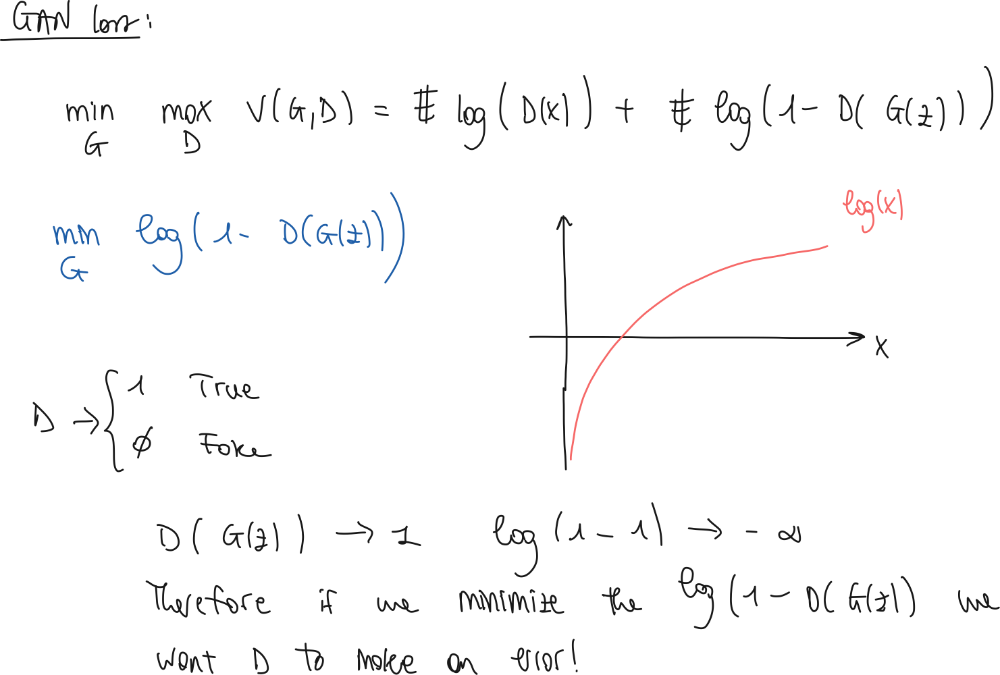

### Introduction

- **What is the problem with vanilla GANs ?**
  - The problem is that there is no way of conditioning the generation of the output (it just generates one of the subsets learned during training)
  - The authors propose a method to produce data given conditional information (labels, ..)
- **What is one problem with the current state of the art neural networks ? and how can it be solved ?**
  - One problem is that it is difficult to predict a large set of output labels.
  - One solution can be to encode with natural language processing the labels of the classes so that there is a relation between different classes
  - e.g. chair, table, ... → furniture class
- **What is the second type of problem ?**
  - Another problem is that networks are usually tailored to predict one to one, whereas it is interesting to have the mapping one to many
    - e.g chair → offcie chair, sofa, ...
  - To solve this problem one can sue conditional generative models.
    - The input is taken as a conditional variable and the one to many distribution is a conditional predictive distribution

### Method

- **What is the difference between GANs and CGANs ?**
  
  - Vanilla GANs, use two networks, generator and discriminator.
    
    - The generator, samples from a noise distribution $p(z)$, process the input, and return an output in the target fromat.
    
    - The discriminator has the role of, given an input in the target format, to output a single probability if the sample has been generated from G or belongs to the training set.
    
    - The way that the networks are trained is such that:
      
      - D outputs 1 if the input belongs to the training set, 0 if from G
        
          $max_D, min_G$ $log(D(x))$ $+ log(1-D(G(z)))$
        
          
    
    - The CGAN differs so that:
      
        
  
  - **What is the general structure of the CGAN, how is the new info incorporated in the network ?**
    
      