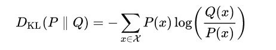

### Introduction and related work

- **What is the objective of a generative model ?**
  
  - A generative model wants to find the parameters $\theta$  that represents a probability density function $p_{\theta}$ to that it resemblances at best the original probability distribution $p$
  - In order to measure the distance different metrics can be used to determine the distance from one pdf to another

- **What kind of divergence metrics can be used ?**
  
  - KL divergence: given P and Q pdfs, the divergence between them is defined as
    
      
  
  - Other metrics include Wasserstein metric

- **In what does maximum likelihood training consist ?**
  
  - ML training aims to train a network by maximizing the likelihood that a set of parameters resembles another pdf
  
  - **What is the basics of the maximum likelihood approach ?**
    
      
    
    - Notice that when using the logarithmic function, then we can transform the product into a summation: log (a*b*c) = log(a) + log(b) + log(c)

- **What are Vairational Auto-encoders ?**
  
  - Variational autoencoders are a type of neural network that is composed of two parts :
    - The first, is the encoder: p(z|x) aims to map the input x into a latent variable z
    - The second is the generator: p(x|z) which aims to reconstruct the latent variable into the input space
  - The differ from classical autoencoders since we have a prior over the lantent space z (e.g Normal distribution), and therefore we can then it to sample from one single input multiple outputs
  - One can sample (generate new samples) by using the generator network
  - To train this the metric needs to include: a KL divergence metric to a prior p(z) (for example a normal distribution) so that it assures that the p(z|x) is smooth.

- **What is the basic idea behid GANs ?**
  
  - The idea of GANs is that we have two functions that play a minimization, maximization game so that:
    
    - The network G (generator) get an imput from a latent distribution (noise) and generates an output that should reseamble the real data
    - The network D (discriminator) needs to distinguish between the real data and the fake data
  
  - The objective function can be defined as:
    
      

### Proposed method

- **How is the 3d scan represented to be fed to the network ?**
  
  - The authors use a a 2d spherical projection, where a the 3d scan is projected into an image based on the aimuth and polar angle.
  - The image is then a tensor of size H x W x 3, where for each h,w coordinate the x,y,z position of the points is stored.
  - This allows for better results than having just the distance d = norm(x,y)

- **How are VAE trained ?**
  
  - The Encoder, Decoder are represented by neural networks, each with different parameters $\theta_{enc}$, $\theta_{dec}$
  
  - In order to train the network:
    
      

- **How are GANS trained ?**
  
  - Usually they are trained using the min max loss function
  - Practically they use: Relativistic Average GAN (RaGAN)
    - [https://jonathan-hui.medium.com/gan-rsgan-ragan-a-new-generation-of-cost-function-84c5374d3c6e](https://jonathan-hui.medium.com/gan-rsgan-ragan-a-new-generation-of-cost-function-84c5374d3c6e)

- **What is the structure of the networks ?**
  
  - The autor uses DCGANs, which consist of a "two" networks for the encoder and decoder:A point set generation network for 3D object reconstruction from a single image.
  
  - The proprieties of such network are:
    
    - UNSUPERVISED REPRESENTATION LEARNING WITH DEEP CONVOLUTIONAL GENERATIVE ADVERSARIAL NETWORKS
      
      