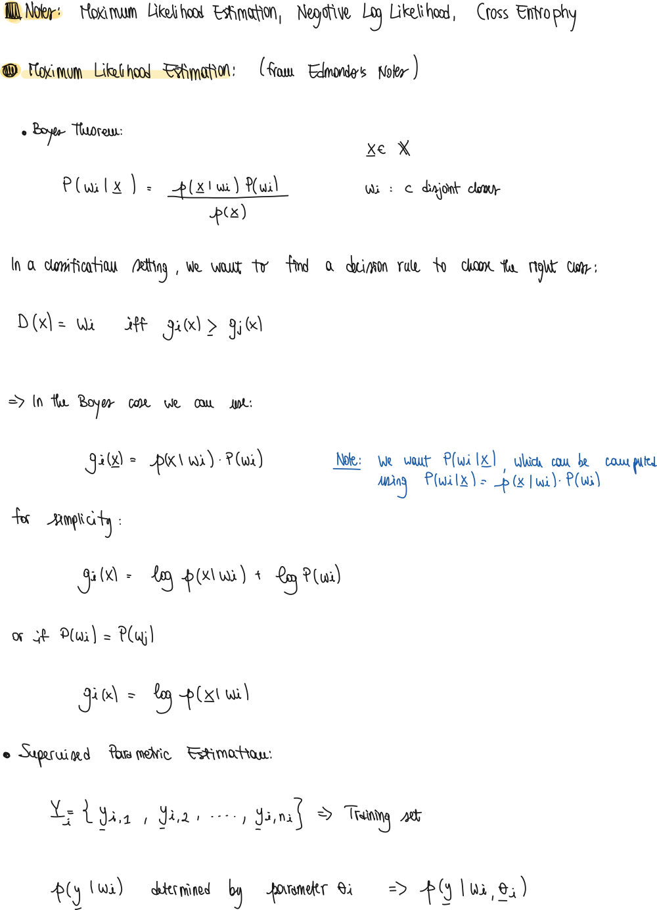

### Useful Links

- [GitHub](https://github.com/wetliu/energy_ood)


## Abstract

- What is the promise of the paper?
    - The paper aims to reduce overconfidence using energy scores instead of softmax score.
    - They also aim to detect out of distribution samples using such energy function using  thresholds.

## Introduction

- What is the idea of energy based functions?
    
    "
    
    "
    

## Method

- How do they use Energy as Inference-time OOD Score?
    - They use the free energy form:
        
        "
        
    - E(x; f) is then used to score the input.
    - In practice:
        - The input $x$ is fed to the network which outputs $c$ logits (for $c$ classes)
        - Then, in order to get the energy score, they do the following:
            
            ```python
            output = net(data) # output: NxC
            score = -(T * torch.logsumexp(output / T, dim=1))) # T=1, score: Nx1
            
            ```
            
- What is the relationship between softmax and Energy score? Why is the softmax a biased scoring function?
    
    "
    
    - Example:
        - Given two examples of in-distribution and out-of-distribution, we can see that their softmax score is almost identical, whereas the energy score is more distinguishable.
        
        "
        
- How can energy be used as a loss function during training?
    - The idea is to have the normal loss function for the class classification of in-distribution samples  and then two hinge losses for separating as much as possible the in and out of distribution samples.
        
        "
        
        "
    


## Notes of base ml theory
- Notes of Maximum Likelihood Estimation, Negative Log Likelihood (`NLL`) and Cross Entropy Loss `CrossEntropyLoss`:
    
    <!--  -->
    "
    
    "
    
    "
    
    "
    
- What is the difference in implementation between the Negative Log Likelihood (`NLL`) and Cross Entropy Loss (`CrossEntropyLoss`) in PyTorch?
    
    "
    
- What is the meaning of the AUROC curve?
    - Webpage of interactive example: [https://mlu-explain.github.io/roc-auc/](https://mlu-explain.github.io/roc-auc/)
    
    "
    
    "
    
    "
    
    "
    
