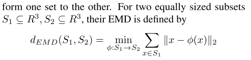

### Fundamental Building Blocks

- What is the meaning of the Earth Movers Distance ?
  
  - The metric allows to measure the distance (similarity?) of two unordered sets of points
    
      

- What does the Chamfer distance compute?
  
  - It computes the similarity of a permutation invariant set of  data.
  
  - Different from the EMD, no bijection is needed, since only the Euclidean distance is used.
  
  - Why is it more efficient than the EMD?
    
    - No need to use an optimization algorithm to find $\phi$
  
  - How is this in practice calculated ?
    
      

- What is the basic structure of the AE?
  
  - Given an input x, the encoder part aims to project the input into a lower dimensionality space. The decoder part aims instead to reverse such projection and therefore reconstruct the original input.

- What is the structure of a GAN?

- What is a Gaussian Mixture Model, and how can it be used to sample new data?
  - It models a pdf into a mixture of Gaussian distributions
  - What underlying assumption is needed for it to work?
    - That the underlying distribution is multimodal Gaussians. (Each subpopulation is assumed to be normally distributed)
  - How does one train it in practice?
    - We use a EM (expectation maximization) → maximize the likelihood that parameters of the GMM represent the training data.

### Evaluation Metrics

- What is the goal of the evaluation metrics?
  
  - How well does a set of point A represent a set B.

- What measures the Jensen Shannon Divergence?
  
  - How is this actually computed?
    - Align the axis of the two distributions. Then divide in voxels. Apply JSD to the empirically evaluated distribution falling the in the same voxels for the two distributions.
  - What does the KL divergence measure?
    -

- What does Coverage measure?
  
    

- What does the Minimum Matching Distance measure?
  
  - Each point of A is matched with the nearest point of B.
  - It differes from the coverage since the latter is not a 1→1 mapping

- What is the correlation between MMD and Coverage?
  
  - A point cloud A is similar to B if coverage is large and MMD is small.

- What is the difference between the two metrics and the JSD?
  
  - Are they correlated?

### Models

- Auto Encoder
  
    
  
  - Effects of the different bottlenecks → Not much improvements after 128
    
    

- Raw-GAN:
  
    

- l-GAN
  
    

### Results

- What can be said about the reconstuction ability of the AEs?
  
    
  
  - What quailitaive metrics are presented to support the claim of good reconstruction?

- What can be observed in the latent space domain?
  
    
  
    
  
  - What can be inferred from these results?
  
  - How can be in practice do shape operations?
  
  - Shape operations:
    
      

- What included the experiment of classification? What results showed