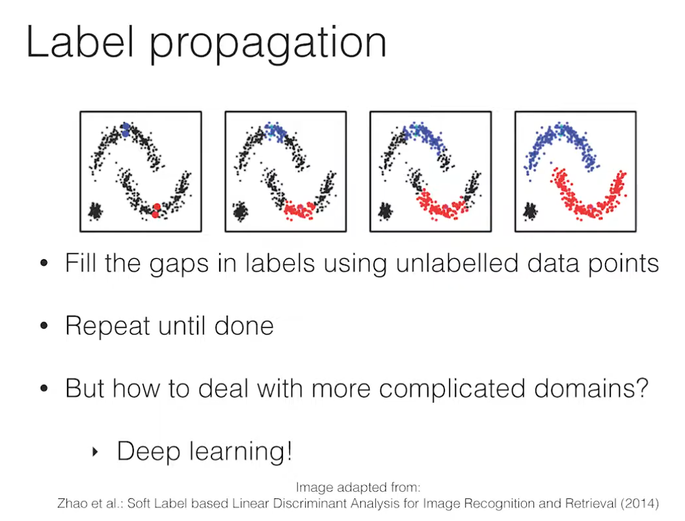

## Useful Links

- YouTube presentation: [https://www.youtube.com/watch?v=0SzTGY132oU](https://www.youtube.com/watch?v=0SzTGY132oU)

## Notes

## Introduction

- What is the **problem** at hand?
  
  - When we want to learn complex features, we use large models that tent to over-fit
  - High quality labelled data is difficult to obtain → we need to use unlabeled ones
  - A model that gives a consistent output from a noisy input is preferable. E.g. a flipped horse is still a horse.

- What is the concept of **label** **propagation**?
  
    
  
  - Given some labeled data, we want to "propagate" such labels to to the other points in the domain, so that similar points have the same labels.

- What happens if we **don't use** any **regularization**?
  
    

- Suppose we want to train a classifier (we see it as a regression problem → blu 0, red 1)

- Given 2 points, we fit a general curve (gray line).

- At the 2 points the error is 0, however, if we move just a slight bit from the points, the results can change by a lot.

- What is the goal with **regularized** **methods**?
  
  - The goal is to force the model to be consistent with the training data.
  - This also means to force it to have a plateau nearby the training data

- How can we use **noise** help us improve things?
  
    
  
  - By adding noise to the big blue circles (small blue ones) we flatten the curve around the labeled points.

- How can we **introduce** **unlabeled** data into **training** and how does the **target value** that we associate with the unlabeled data **affects the training**?
  
    
  
  - The black big circle is the unlabeled data (x position), it's associated value it's his y coordinate.
  - One way of using unlabeled data is to use the student teacher paradigm.
    - The student learns normally (back-propagation)
    - The teacher model is responsible for generating the targets for the student.
  - Now, since the teacher model also does not know the real value of the unlabeled data, it's prediction might be wrong (see top image) and therefore it can be affected by confirmation bias.
  - We can also add a consistency cost between the output of the student and the teacher.
    - This is done by adding noise to the input (black small dots) of the student model and feeding the teacher the clean input.
    - By imposing a consistent value between the two outputs then we can flatten the curve of the teachers predictions. →This does not guarantee that the prediction is on the first place correct, just makes it consistent.

- How can **we improve** on this?
  
    
  
  - We can add noise to the teacher model.
  - This has the effect that if we average the teachers predictions (empty small circles) then the final average will have less bias (smoother).

## Related Work

- What is the idea of **Temporal Ensembling**?
  - The idea is to use a student, teacher model and update the predictions of the teacher based on the exponential moving average **(EMA)** of the previous values.
  - This actually means that for each epoch we store the predictions of the model in a EMA way (we keep track of multiple steps). Then given the output at time k (now) this output is changed to incorporate also the k-1, k-2, ... predictions (usually the average of the predictions)
- What is the **problem** with this **approach**?
  - The changes are really slow, we need an entire epoch to take advantage of the EMA.
  - When we do the update, our current model might be much better than the previous one (maybe making things worse, or at leas slowing learning).
  - Does not scale to large datasets.
- **Why** does **EMA** work?
  - Our model predictions or weights are noisy.
  - Therefore by taking the average of the predictions or weights we actually go nearer to the actual optimal value.

## Method

- How to they **solve** the **problem** (improve on Temporal Ensembling)?
  
  - Instead of averaging the predictions they average the weights of the model.
    
    
  
  - Given an input, the student and teacher evaluate it with additional noises to their weights.
  
  - The student loss consist of the classification loss (one hot encoding) and the consistency loss (with the teachers output → mean squared error)
  
  - The student weights are updated normally.
  
  - The teachers weights are updated with EMA
  
  - At the end the teacher gives more accurate predictions

- How does the **consistency** cost look like?
  
    
  
  - Expected distance between the student model and the teachers

- How are the **weights** of the **teacher** updated in **EMA** fashion?
  
    

- How can this **applied** to **unlabeled** **data**?
  
  - Train the same as with labelled data but do not use the classification cost.
