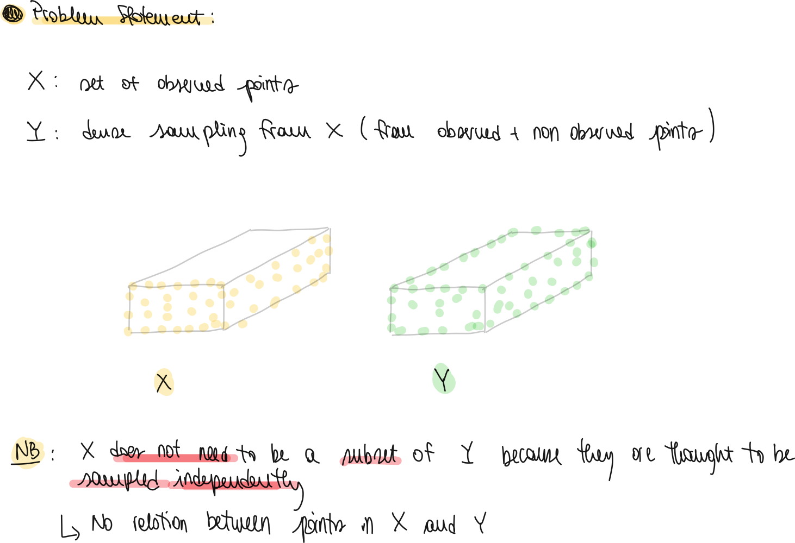

## Short Description

- It's a point reconstruction network which uses a folding decoder and a fully connected one.
- They use it to complete scans in the Kitti Dataset.

## Notes

- Folding Operation paper: [https://arxiv.org/pdf/1712.07262.pdf](https://arxiv.org/pdf/1712.07262.pdf)

## Introduction

- What is the **goal** of the **proposed** **network**?
  - Complete the shape of a partially occluded or incomplete 3D shape.
- What are the **challenges** when trying to **solve** such **problem**?
  - The network should be permutation invariant (feature extractor + loss function also feature invariant)
  - No clear neighbors
  - Generate enough points to really complete the shape
- What are their **main** **contributions**?
  - Learn directly on 3D point clouds
  - Coarse to fine generation of such points

## Related Work

- What methods are used for **3D** **shape completion**?
  - Geometry based approaches: they reconstruct the input from geometric cues (e.g. symmetry → reconstruct the other part from the symmetric present part, half a ball missing)
  - Alignment based approaches: match the shape with existing databases of shapes.
  - Learning based approaches: use neural networks to map the input to the output. Fast inference.
- What are **networks** proposed for deep learning on **Point Clouds**?
  - PointNet and other variations for the encoder
  - Decoder not really studied. Also problem of not being able to generate more points than the gt.

## Problem Statement

- **What** is the **problem** at **hand**?
  
    

- **How** do they **solve** this problem?
  
  - They use a syntetic dataset (ShapeNet)
  - Train a network to reconstruct from sampled points on the gt to the gt.

## Point Completion Network

- What is the **general** **structure** of the network?
  
  - It is an encoder decoder network.
  - The encoder takes the input and outputs k-dim feature vector.
  - The decoder takes such vector and outputs a coarse point cloud and then a fine one.
  - The loss then compares the gt with the output of the networks.

- **What** **observations** are made regarding the network learning?
  
  - They do not enforce directly the network to have as output the points in the input.
  - But the network learn a projection from observed to completed shape

- What is the **structure** of the **encoder**?
  
  - It's two stacked PointNets which take m points and then output v points
    
      

- What is the **structure** of the **decoder**?
  
  - It's a combination between the fully connected layer which is good for extracting information about the global features and the folding decoder which is good for local features
    
    

- What is the **idea** behind the **folding** **decoder**?
  
    

- What **loss** **function** do they use?
  
    
  
  - The term **d1**: is a combination of CD and EMD between the coarse output and a sub-sampled gt with the same size
  - The term **d2**: is just CD between the detailed output and the full gt
    - NB: EMD would be too expensive for the full pcl

- What is the **meaning** of the **Champfer Distance (CD)**?
  
    
  
  - The first term forces the output to lie close to the gt. The second forces the output to cover the entirety of the gt.

- What is the **meaning** of the **Earth Mover's Distance (EMD)**?
  
  - The EDM is a distance metric between two sets S1 S2 of equal size (cardinality).
    
      
  
  - The distance defines an optimization algorithm (finding of $\phi$). In practice this is too expensive, so it is approximated.

## Experiments

- What is the **setting** of the **experiments**?
  - They test their results against different version of themselfs and PointNet++ and 3DEPN (volumentric method)
  - They create a dataset from ShapeNet
  - They test the results using both CD and EMD
- What are some of the **key results** that their network **achieves**?
  - Better generalization of new unseen shapes
  - Better overall results than 3D volumetric methods
  - The use of both folding and fc decoders yields better results as if we use only one type
  - Having 2 stacked point nets is better than a single PointNet++. This is because the local pooling is less stable than global pooling.
  - The model is robust to induced noise and partial occlusion.
- How is the **completion** **results** on the **KITTI** performed?
  - Given a bbox, they extract the points inside it.
  - This set of points is then completed using the network.
  - The points are then transformed back into the point cloud.
  - The metric that they use to evaluate themself consist on:
    - How similar in successive scans the same auto is reconstructed?
    - How well this reconstruction matches with the original points?
    - How well does the reconstruction match with the nearest shape in the training set.
  - They test the network on point cloud registration. They have better results if the pcl is completed.