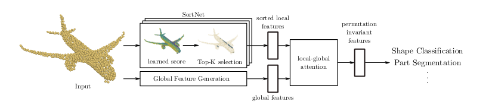

## Introduction

- What is the **problem** that they want to **tackle**?
  
  - They want to use an attention mechanism to process point clouds.
  
  - However, attention is just permutation equivariant and not not invariant
  
  - Therefore they propose SortNet as a way of extracting an ordered set of features based on their learned scores
  
  - They then use local global attention to fuse the output of SortNet (local features) with the global ones which yields an ordered set of features (permutation invariant) which can be used for point classification and segmentation
    
      

## Related Work

- What is a **problem** with the **current** **approaches** for operating **directly on 3D point sets**?
  - The pooling operation allows to aggregate features, however if the pooling operation reduces so much the information that does not capture anymore information of the shape.
  - They propose a network that solves this problem by taking into consideration the entire point cloud and returning point features that encode global and local information about the structure.
- What is the **difference** between **Point Transformers** and **Set Transformers**?
  - They are similar, but Point Transformer is designed for Point Clouds.

## Fundamentals

- How is **Attention** and the **Transformer** architecture introduced in the work?
  
    
  
    
  
    

## Point Transformer

- What is the **goal** of the network? How is this achieved?
  
  - It's a network based on the Attention mechanism and the Transformer architecture that is permutation invariant.
  - They use SortNet to output ordered set of points

- What is the **structure** of the **Point Transformer**?
  
    
  
  - They have 2 independent branches which generate local features and global ones.
  - The Local ones are generated using rFF to project the input into the latent space and then SortNet outputs an ordered set of points based on the learnable score of the inputs.
  - The Global branch is generated using PointNet++
  - The Local Global attention attends and scores the local features against the global ones

- How is **SortNet** related to **CNN kernels**?
  
  - CNN kernels are activated based on the local input that they are computing
  - SortNet outputs an output based on the learnable score of the feature representation

- **How** does **SortNet** **work**?
  
    
  
    

- How are the **Global** **Features** extracted?
  
    

- **How** does **Local-Global** Attention **work**? What is the **meaning** of the **result**?
  
  - The LG attention mechanism applies a cross attention mechanism between the local and global features.
    
      
  
  - The result is an output which expresses how well the local features relate to the global ones
  
  - The output is permutation invariant
  
  - This has the advantage of not using pooling so it does not reduce the dimensionality of the output

- How is **shape classification** performed?
  
  - Take the output of $A^{LG}$ flatten it → FC → softmax

- How is **part** **segmentation** performed?
  
    
  
  - They have in the global feature generation a dim projection to dm''
  - Then they cross attend each point of the input (latent dm'', $A^{LG}$)
  - The similar to the classification FC and then softmax but for each point)

## Results

- What can we **observe** from the **results**?
  
  - On shape classification it performs on pair with the state of the art
  - On part segmentation is a bit lower but comparable

- What is observed from the **ablation** study of **SortNet**?
  
  - The check if the top K selection is really important
  - It is because when the selection of the points is random or using FPS then the result are worse
  - They argue that SortNet identifies important parts of the shape for the task at hand

- What is observed from the **ablation** study of the **Global Feature Extractor**?
  
  - The see that if they use the whole set in the ALG then the results are worse.
  - However by using a subset of MSG then it improves. Fewer and more meaningful points.

- How is the **robustness** to **rotation** evaluated?
  
  - They apply a random rotation (not the one used in training) to the network.
  
  - The accuracy remains similar, in PointNet++ it drops quite a lot.
  
  - The argue that is because of the learned top K points that are always the same ones.
    
      

- **What** does **SortNet** **Learn**?
  
  - The selected points in SortNet are similar when shapes are different.
  
  - They argue that the network is aware of the underlying shape
    
    