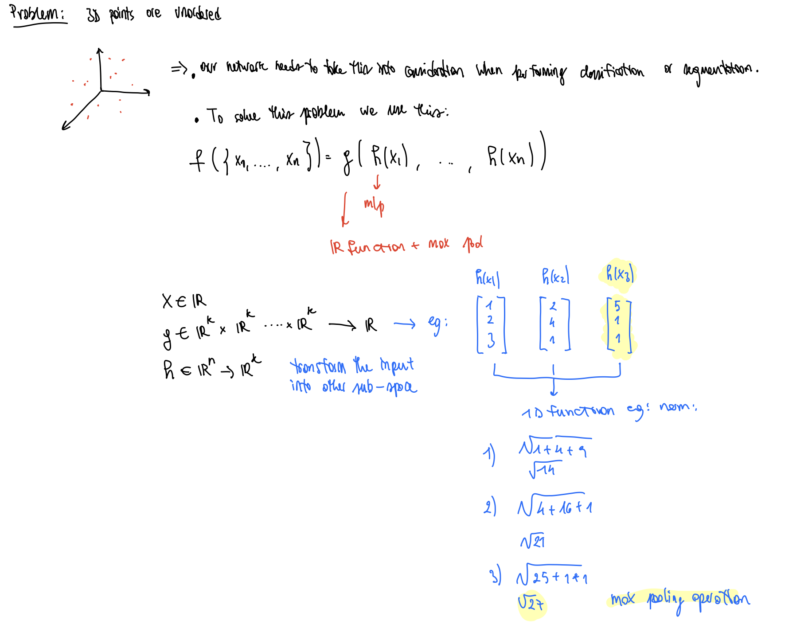

## Introduction

- What is the problem with the current approaches that deal with 3d points?
  - Points are usually transformed into other representations e.g. images, voxels, .. and then fed to neural nets.
  - This is however not ideal since the representation is much more complex and the sparsity of the representation is lost.
- What is the solution of the authors? What need to be respected in PointNet?
  - They use a network called PointNet which takes as input only point clouds (set of 3d points).
  - The network needs to respect the features of a point cloud. It needs to be permutational invariant and symmetric to rigid transformations (transformation in space that maintains the euclidean distance between points).
- What can PointNet do? What is the basic principle?
  - It can either output a label for the entire set of points (object label) or a point wise segmentation label (segmentation).
  - The idea is that each point $(x,y,z)$ is processed individually.
- What is the basic idea of the network? How does it work?
  - The network uses a single symmetric function (max pooling) to learn features about the shape of the object. It then feeds such features to a fully connected layer to perform classification or segmentation.
- What is the role of the transformer network?
  - The network is used to easily apply geometric transformations to the set of points.

## Deep Learning on Point Sets

- What are the proprieties of a point set in $R^n$?
  
  1. The points are unordered. In a set with $N$ points, there are $N!$ permutations 
  2. There is a locality of the points. Meaning that regions of points "interact" with each-other forming local clusters of points. The points are not isolated.
  3. The point set is invariant to transformations. 

- How does point-net solve the permutation problem?
  
  - There are different solution to make a network invariant to permutations. For example, one can apply an ordering, or train a RNN with random permutations hoping to teach the network that the order does not matter.
  
  - There two are however not ideal solutions, since finding an ordering in $R^n$ is not straight forward and training a RNN is not easy for large sequences.
  
  - The authors resort in finding a symmetric operator that yields the same result independent of the order of the points. In the paper they use a N→1 transformation (norm) and an max pooling function operator.
    
    

- How does point-net solve the locality of the points?
  
  - In order to solve this problem, the network architecture allows to extract global features e.g. using the max pooling layer mentioned above, which should represent global features of the point set.
  
  - Such features are then concatenated with the local structure, allowing the finale layers of the network to have both local and global informations.
    
      
  
  - In the image above the network concatenates in the segmentation network a  $n*64$ with $1 * 1024$

- How does point-net solve the problem of transformation invariance?
  
  - The idea is to align the points into a canonical space. This means that we want for example cars and buses to be aligned in the same direction, e.g. the front aligned with x axis.
  - To achieve this another network is implemented called T-Net which predicts a 3x3 transformation matrix which should ideally represent the transformation matrix to the canonical space. Another T-Net is done and predicts a 64x64 transformation matrix.
  - The last T-Net could resort in some problems since we are now dealing with a 64x64 matrix, hence more difficult to optimize than the 3x3 in the point space.
  - To achieve better performances the authors  introduce a a loss term which imposes that aligment matrix to be orthogonal. (rotation matrices are orthogonal)

- Describe the mIoU used to verify the performances of the segmentation network:
  
    

## Training Details

### Augmentation

- Rotation along the z axis and jitter of the points with normal noise

## Notes

- **What is the input output format of the network ?**
  
    

- **What proprieties does a set of point in $R^n$ have ?**
  
  - Unordered → invariant to N! permutations
  - Distance metrics applies → local points form local features
  - Invariant to transformations

- **How does the network deal with point invariance?**
  
    

- **How does the network deal with local and global features ?**
  
  - The network (segmentation) deals with it by concatenating both local and global features
    
      
    
    - This can be seen in the input of the Segmentation Network, where the global features are concatenated with the "local" features of one of the layers of the Classification network, therefore making one input that incorporates them both.
  
  - **How does the network deal with invariation in transformations ?**
    
    - The network uses another mini-network, that predicts an affine transform (firt Input Transform)
      
      - Such network is similar to the big one
      - More details in the implementation here: [https://keras.io/examples/vision/pointnet/](https://keras.io/examples/vision/pointnet/)
    
    - The same principle can be used when working in the feature space
      
      - This time the network has much more dimensionality, so there is a constrain in the predicted transformation:
        
          

## Notes on ML Concepts:

- 1D Conv
  
    

- Max pool as symmetric function
  
    

- Loss function:
  
  - We use the cross entropy loss function:
  - Link for the explanation:  [https://gombru.github.io/2018/05/23/cross_entropy_loss/](https://gombru.github.io/2018/05/23/cross_entropy_loss/)