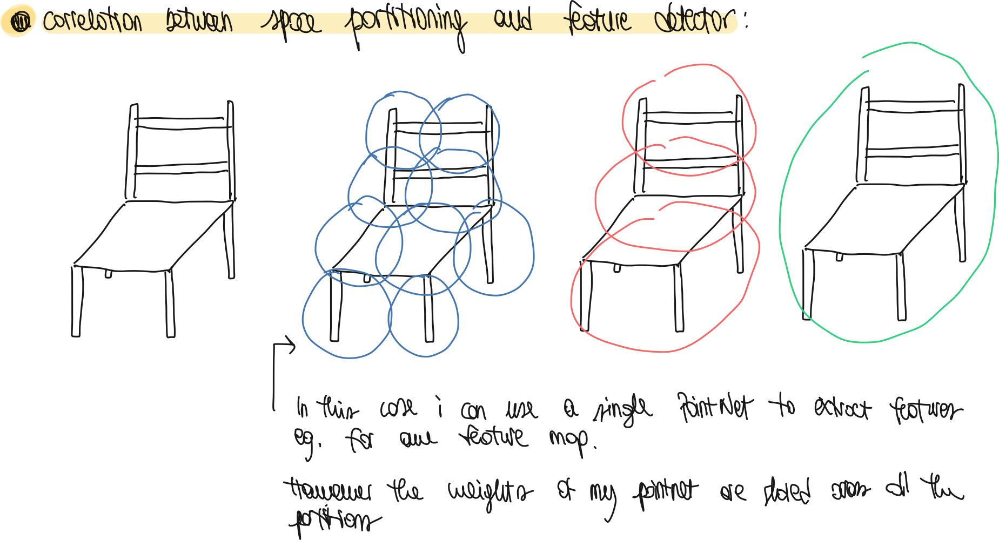

## Short Description

- PointNet but with hierarchical feature grouping. Basically not just iid points features, but it also relates point in space with their neighbors

## Useful Links

- Faster Pythorch CUDA Implementation: [https://github.com/sshaoshuai/Pointnet2.PyTorch](https://github.com/sshaoshuai/Pointnet2.PyTorch)

## Introduction

- What are the characteristics of a point cloud set?
  
  - A point cloud is a set of point in an Euclidean space. The set is invariant to permutation of the points (unordered)
  - Dependent on the measurement metric, a set can have different characteristics on different portion of the space (local neighbours) e.g. density of points.

- What is the basic idea of PointNet?
  
  - The basic idea of PointNet is to generate a set of features (spatial encodings) for each point, and then combine them together.

- What does PointNet lack by design? How is this feature that lacks instead used in CNN?
  
  - PointNet does not leverage the local neighbor structure that a point cloud can have.
  - In CNN the kernel sizes are such that for lower layers, the neurons have smaller receptive fields to they capture fine structures. Whereas for higher levels the receptive fields are larger.

- What is the idea of PointNet++? How does it work?
  
  - The idea of PointNet++ is to divide the space into overlapping subspaces, and similar to CNN generate fine structures from such subsets.
  - Those subsets are then grouped together into larger subsets which will generate more coarse features.
  - The process is repeated till the entire set of points is grouped.

- What are the two main issues that the design of PointNet++ needs to adress? How are they correlated?
  
  - By design PointNet needs to address two issues. The first is how to partition the space and the second is how to extract features from such partitions.
  
  - The two issues are correlated because the space partitioning needs to produce common structures so that the weights of the local feature learner can be shared like in a CNN.
    
      
  
  - For the local feature learner a PointNet is used.
  
  - **Notice**: in CNN we call receptive field the region of the image which we are applying the filter. With filter, kernel, feature detector we call the matrix of weights itself. The result of the kernel multiplication by the receptive field is called feature map.

- How are the overlapping partitions of the point set generated? How does this compare to a volumetric CNN?
  
  - The overlapping partitions are generated using an algorithm (farthest sampling point algorithm) which takes into account the input data and the measurement metric, making this more efficient compared to a constant sampling.
  - A single partition is defined as a ball in the Euclidean space (center, radius)
  - This is different from the way that CNN for images are used, since the density is the same across the whole 2D region.

- Why is it difficult to decide the size of the neighboring balls? What can be said with respect to CNN?
  
  - It is difficult to select the size of the space partitioning since it depends on the density of points of a local neighbor.
  - In CNN smaller kernel sizes yield to better results. In here, smaller partitioning do not work because they might include too few points for PointNet to find good feature maps.

- What is the main contribution of the paper?
  
  - The network allows to compute hierarchical feature extractions at different scales.

## Problem Statement

- How can the problem statement be described?
  - We have $X = (M, d)$ is a discrete metric space. $M$  is a set of discrete points and $d$  is a metric space.
  - We also suppose that M is not uniformly dense.
  - Our goal is to find a function f such that given X it return semantic information about X. This can be viewed as a classification function that assigns a label to each point in M.

## Method

- What is the difference between how PointNet and PointNet++ aggregate points?
  
  - PointNet aggregates the point features with a single max pool operation. PointNet++ does this hierarchically selecting bigger and bigger regions.

- Describe the **Hierarchical Point Feature Set Learning**.
  
    
  
    
  
    
  
    

- What is the **structure** of **PointNet++**? How does it **learn** in **non uniformly sampled point sets**?
  
  - In point clouds, we might have regions of space which are non uniformly sampled. Therefore the features (weights) learned in an uniform set might not work in a less uniform one.
  - To contract this, PointNet++ takes the Hirarchicha Point Feature Set Learning of the previous section and changes it to adapt it to multi scale feature learning.
  - This means that we change point 2 and 3 (grouping and pointnet layers)
  - In the grouping layers we have now multiple ball queries, with increasingly higher radius.
    - This allows to have multiple sets of neighbor points.
  - Such neighbors sets are then transformed into feature vectors using PointNet layers.
  - All the feature vectors are then concatenated together to form a multi scale feature vector. The concatenation strategies are the following: Multi Scale Grouping (MSG) and Multi Resolution Grouping (MRG)

- What is the **idea** of **Multi Scale Grouping (MSG)**?
  
    
  
  - In here we can change directly the grouping layer and have multiple resolutions.
  - The points are then fed to a PointNet and they are concatenated together

- How is the **network** **trained** in **MSG**?
  
  - To make the network more robust, they use a dropout strategy.
  - For each input set, they drop out points with probbility $\theta \in [0, p]$ with p = 0.95
  - This allows the network to always have different training samples (different groups of points) and with different densities also caused by the dropouts which happen all in different regions of space.

- What is the idea of **Multi Resolution Grouping MRG**?
  
    
  
    
  
  - The idea is to compute set abstraction at each layer, however not doing it at multiple scales, but using the previous layer (with more points) to add more infos.
  - The idea, (like shown in the figure 2) is to use 2 vectors.
  - The first one (right) is computed normally with an abstraction layer, meaning that given the centroids, we perform grouping and then use PointNet to encode.
  - The second one (left) is taken from using the abstraction layer result of the next layer (the one with fewer points)
  - This allows to combine general (right) and finer (left) features form the point set.
  - The authors argue that if we have sparse info, then left should have less weight because it contains less points to work with.

- What is the idea behind **Point Feature Propagation** for Set Segmentation?
  
  - Problem: when segmenting, we want to have an output for each point. However, since until now we just have down-samples, we don't have a 1→1 correspondence to the input and also we have less points.
  
  - They solve the problem by using feature propagation.
    
    - A level $N_l$ has less points than $N_{l-1}$.
    
    - They take the points features (encodings) at a level $l$ and and interpolate the features using the k=3 nearest neigbours.
      
      - Notice: this interpolation has just the role to define a new feature vector that for a point at level $l-1$.
      
      - The interpolation is actually just an average of all the features of the neighbor points weighted by the inverse distance.
        
          
  
  - After that we have interpolated all the point features for the level $l-1$ we can now use a unit pointnet (like  a 1x1 convolution)
    
    - NB: they are usually used to change the dimensionality of the filters, not here tough)
  
  - Then at the end we have the fully connected layers with relu to output class probability for each points.
    
    - More on the implementation here: [https://github.com/charlesq34/pointnet2/blob/master/models/pointnet2_sem_seg.py](https://github.com/charlesq34/pointnet2/blob/master/models/pointnet2_sem_seg.py)

## Experiments

# Extra Material

- Weight sharing in CNN
  
  - [https://www.youtube.com/watch?v=ryJ6Bna-ZNU](https://www.youtube.com/watch?v=ryJ6Bna-ZNU)
    
    

- CUDA Programming
  
    [https://www.nvidia.com/docs/IO/116711/sc11-cuda-c-basics.pdf](https://www.nvidia.com/docs/IO/116711/sc11-cuda-c-basics.pdf)

- FPS Algorithm
  
  - [https://jskhu.github.io/fps/3d/object/detection/2020/09/20/farthest-point-sampling.html](https://jskhu.github.io/fps/3d/object/detection/2020/09/20/farthest-point-sampling.html)
  - [https://github.com/charlesq34/pointnet2/issues/26](https://github.com/charlesq34/pointnet2/issues/26)

- Some legacy notes:
  
  - Describe the overview of the set abstraction layers
    
      
  
  - **Sampling Layer:** Describe the FPS algorithm (more notes on the extra material)
    
      
  
  - Describe the **Grouping Layer:**
    
    - The layer receives Nx(d+C) points and the coordinates of the centroids N'xd
    - It return N'xKx(d+C) points, where K is the number of points in the neighborhood of the centroid.
    - The number of point K varies across the different groups.
    - In order to find the points in the centroid sphere, the ball query is used: is a point inside a sphere?
  
  - Describe the **PointNet layer**:
    
    - The input is a N'xKx(d+C) matrix of points.
      - Notice, we will have N' PointNets (number of centroids)
    - The points are translated to be in the reference frame of the belonging centroid and then fed to the network.
    - This change of reference frame + the point features (C) allow to capture local region features.