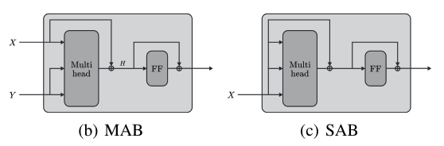

## Useful Links

- Github Implementation repo: [https://github.com/TropComplique/set-transformer](https://github.com/TropComplique/set-transformer)

# Notes

## Introduction

- **What is** the **problem** that they try so solve?
  - The problem at hand is to work with set input data.
  - For example, multiple instance classification where given a set of images we want to have the resulting label for all of them.
  - Or 3D shape recognition. Set of 3D points which we want to classify in a class.
- What **proprieties** should a **model** that processes **set-input problems** have?
  - It should be permutation invariant (input order does not change the output order)
  - It should be able to process an input of any length
- **What is** a **network** structure **that satisfies** the two aforementioned **proprieties**?
  - Given a set, feed to a feed forward network each element independently.
  - The embeddings are then aggregated together via pooling operation
  - The resulting vector undergoes under other non linear transforms
- What is a **problem** with the **previous** **network**?
  - The element are processes independently.
  - Therefore the interaction between them is lost.
- What are the **contribution** of the **paper**?
  - Self attention mechanism to process input sets
  - Reduce computation time of self attention from $O(n^2)$ to $O(mn)$, m fixed
  - Self attention for feature aggregation when an output depends on the other outputs

## Background

- What are the **background** **topics** reported?
  - Pooling architectures for sets → achieve permutation invariance in a set
  - Attention mechanism

## Set Transformer

- **How** does **this** method of **pooling** **differ** from the **classical method**?
  
  - In classical method the pooling operation takes each instance as independent form the others.
  - Here, the self attention mechanism is used to compute pariwise or higher order interactions among instances.

- How is **SAB** (Set Attention Block) computed?
  
  - We first start by defining the MAB (Multi Head Attention Block)
    
      
    
      
    
    - This is similar to the attention block of the encoder in the Transformer network.
  
  - The SAB is the defined as MAB on the same set of inputs MAB(X,X)
    
      
  
  - Multiple self attention blocks can be stacked together to capture more interactions between the elements of the set.
  
  - Notice that one could think that SAB only learns a residual connection on X, but since we have the matrix multiplication for keys queries and values and the non linearity of the activation function, more complex functions are learned.

- **What is** a row wise feed forward net (**rFF**)?
  
  - `**torch.nn.Linear**(in_features, out_features, bias=True, device=None, dtype=None)`
  
  - Applies a linear transformation to the incoming data:
    
    - $y=xAT+by$
    
    ```python
    class RFF(nn.Module):
      """
      Row-wise FeedForward layers.
      """
      def __init__(self, d):
          super().__init__()
    
          self.layers = nn.Sequential(
              nn.**Linear**(d, d), nn.ReLU(inplace=True),
              nn.Linear(d, d), nn.ReLU(inplace=True),
              nn.Linear(d, d), nn.ReLU(inplace=True)
          )
    
      def forward(self, x):
          """
          Arguments:
              x: a float tensor with shape [b, n, d].
          Returns:
              a float tensor with shape [b, n, d].
          """
          return self.layers(x)
    ```

- What is the **computational** **complexity** of SAB?
  
    

- ⚠️ How does **ISAB** (Induced Set Attention Block) **solve** this **problem**?
  
    
  
  - ISAB works like an auto-encoder, where the conditionality of X is reduced to a lower feature space of dim $m$
    
      
  
  - In the formulas, the set $I$ is part of the network itself (learnable parameters).
  
  - MAB(I,X) return a vector H which aims to represent global features that describe X
  
  - Then H is attended to X itself by MAB(X,H) which returns n vectors
  
  - The computation complexity of the last block is then reduced to O(mn)
    
    - ⚠️ To get the m vectors, we need O(mn), however then to get the n vecotrs we need again O(mn). Shouldn't we have 2O(mn)?

- How does **PMA** Pooling Multi Head Attention Work?
  
    

- What is the **overall structure** of the **Set Transformer**?
  
    

## Experiments

- How do they test that **PMA** is **as good** as **classical** **pooling** operations? (e.g. **max pool**)
  
  - They aim to find the max of a set of numbers.
  - Result show comparable results between max and PMA
  - Notice that the task is extremely in favor of max pool, since it can just teach the encoder to be an Identity function

- What do they do for **unique** **character** counting?
  
    
  
  - Count how many different characters in a set.
  
  - They use a Poisson Regression model for the loss. And maximize the max likelihood.
  
  - Result show that set transformer is better than the others. Also ISAB is better even with m=1 than other variations
    
      

- What does the **amortized** **clustering** experiment yield?
  
  - The goal is to maximize a the log likelihood of a gaussian mixture model.
  - Set transformer is tested against Estimation Maximization EM algorithms (iterative)
    - It shows better results, because it does not depend on statistics

- What did they do in the **Set Anomaly Detection**?
  
  - Given 8 images, 7 2 common traits and one not.
  - Set transformer outperforms other methods

- What was the experiment for **Point Cloud classification**?
  
  - Given the point clouds e.g. 5000 points classify the shape.
  - They were outperformed → because the point themself had enough information for classification without need of self attention