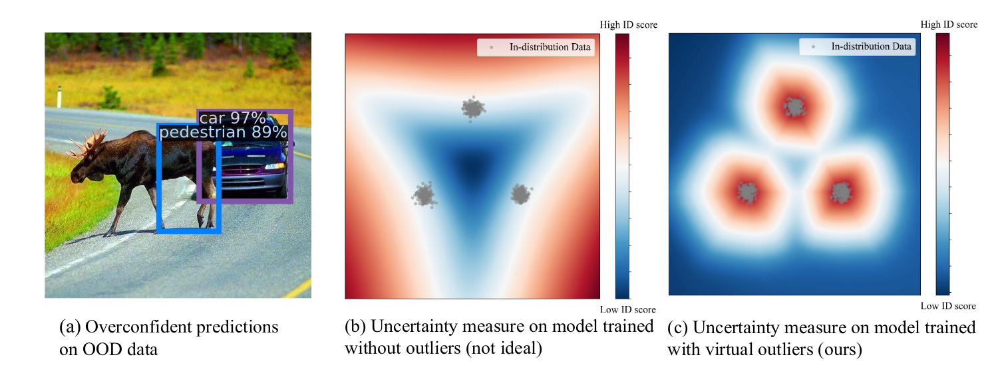

## Useful Links
- [GitHub](https://github.com/deeplearning-wisc/vos)

## Abstract

- What is the promise of the paper?
  - They propose a new ood sampling approach from low log likelihood regions
  - They propose a new loss function for outlier detection separation

## Introduction

- What is the problem at hand?
  
  - Neural networks are often overconfident in making decisions when OOD data is presented.
  
  - The main reason for this is that the loss function is only optimized for ID (in-distribution) data, which leads to overconfident decision in far away boundaries.
    
      
  
  - Therefore the authors propose a way to sample OOD data.

- What is the main idea of the proposed method?
  
  - The main idea is to sample OOD data from the feature space, which is more tractable than the pixel space.
  - Then they propose an optimization function which allows to simultaneously train for in-distribution data detection and to output and anomaly score for OOD data.

## Method

- What is the idea of the method?
  
    
  
    
  
    
  
    
